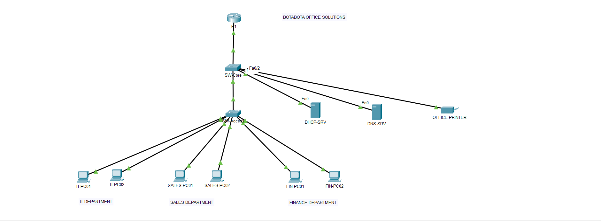
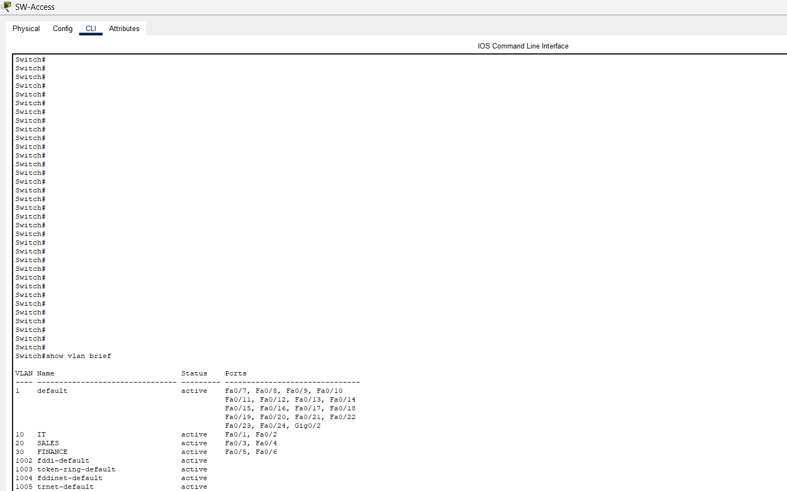
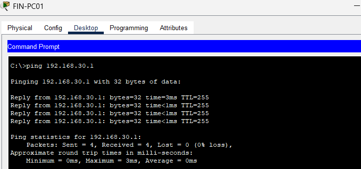

# Botabota Office Solutions

### Small Business Network & IT Support Troubleshooting

A Cisco Packet Tracer project focused on designing, configuring, and troubleshooting a small business network.

The project began as a simple flat network and was progressively improved with **VLAN segmentation, inter-VLAN routing, centralized DHCP, DHCP relay, and internal DNS**.

---

## 📌 Project Overview

**Botabota Office Solutions** is a simulated small business environment with separate IT, Sales, Finance, and Server networks.

The project demonstrates how a network can be **built, tested, expanded, and supported through realistic IT incidents**.

### Network Structure

| VLAN | Department | Network           |
| ---- | ---------- | ----------------- |
| 10   | IT         | `192.168.10.0/24` |
| 20   | Sales      | `192.168.20.0/24` |
| 30   | Finance    | `192.168.30.0/24` |
| 40   | Servers    | `192.168.40.0/24` |

---

## 🖥️ Network Design

**Core components:**

* Cisco router
* Core and access switches
* Department workstations
* DHCP server
* DNS server
* Network printer

**Key technologies:**

`VLANs` · `802.1Q Trunking` · `Router-on-a-Stick` · `DHCP` · `DHCP Relay` · `DNS` · `IPv4`

---

## 🔧 Project Progression

### 1. Initial Network

The network was first configured as a flat `192.168.10.0/24` network with:

* DHCP
* DNS
* Network printer
* Basic connectivity testing

### 2. IT Support Troubleshooting

Realistic support incidents were introduced to practice structured troubleshooting.

| Incident    | Issue                                  | Resolution                           |
| ----------- | -------------------------------------- | ------------------------------------ |
| **INC-001** | Incorrect workstation IP configuration | Restored DHCP configuration          |
| **INC-002** | Incorrect DNS server                   | Corrected DNS configuration          |
| **INC-005** | Sales VLAN connectivity/DHCP issue     | Corrected VLAN gateway configuration |

Detailed investigation steps are available in [`troubleshooting-incidents.md`](documentation/troubleshooting-incidents.md).

### 3. Network Upgrade

The flat network was upgraded into department-based VLANs.

Inter-VLAN routing was implemented using **router-on-a-stick**, while DHCP relay allowed clients in different VLANs to obtain addresses from the centralized DHCP server.

---

## 📸 Network Evidence

### Final Network Topology

### VLAN Configuration

### Troubleshooting Verification

---

## 🛠️ Skills Demonstrated

* Network design and configuration
* IPv4 addressing and subnetting
* VLAN configuration
* Trunking
* Inter-VLAN routing
* DHCP and DHCP relay
* DNS configuration
* Cisco IOS
* Network troubleshooting
* Incident documentation
* Fault isolation and verification

---

## 📂 Project Files

* [`Packet Tracer Network`](packet-tracer/Botabota_Office_Solutions02.pkt)
* [`Troubleshooting Incidents`](documentation/troubleshooting-incidents.md)
* [`Screenshots`](screenshots/)

---

## 🎯 Project Goal

To demonstrate practical **networking and IT support skills** through the complete lifecycle of a small business network—from initial setup and testing to network segmentation and troubleshooting.

**Built and tested in Cisco Packet Tracer.**

